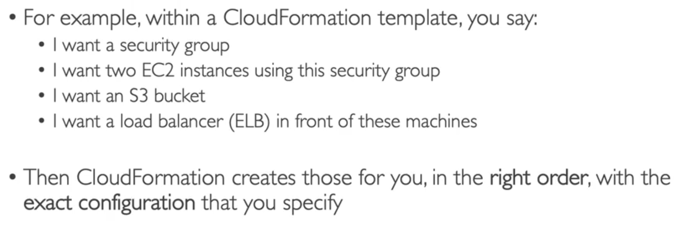
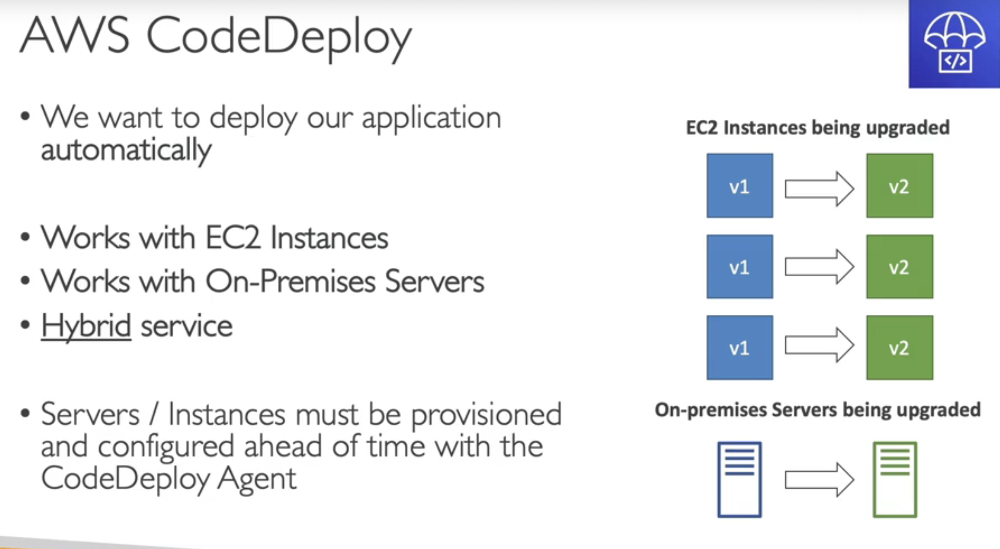

#######################
CloudFormation
Yaml file

Cost:
Each resources have an identifier so you can see how much a stack cost you
Saving Strategy (eg. start at 5 ,then recreate at 9)

Productivity:
Automated Diagram for you
No need to figure out ordering (which service first)
You can use existing templates from the web etc.

Cloudformation is the base of Infrastructure as code.
Repeat architecture in different envs, region or acounts.

########################
Cloud Development Kit

Instead of Cloudformation (its yaml), use a more familliar language(python,js etc.)
The code will be compiled in YAML finally in Cloudformation format

So we use it before Cloudformation always

#########################
BeanStalk (Platform as a Service)

Beanstalk is free but you will pay the underlying services

Health Monitoring built in

#########################
CodeDeploy
only handles EC2, does not take into account LoadBalancing, ASG etc.
