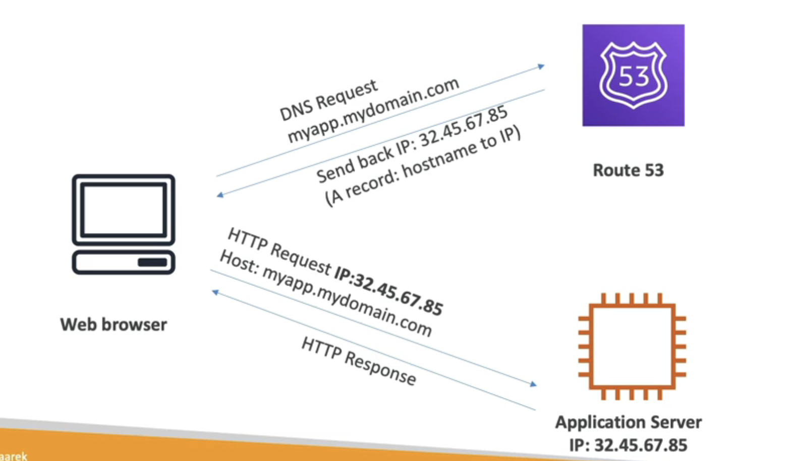

#########
Route53 (DNS)

basic records:

Basics of DNS work:

Routing policies:
Simple routing policy (no health checks)
Weighted routing policy (distribute traffic based on weighting, like loadballancing) healthcheck
latency routing policy (will look where the user is located and set the closest ip) healthcheck
failover routing policy (dns does healthcheck and in case of disaster goes to other instance)

#######
CloudFront

Caches requests, for the next user not to wait the full route.
Waf + Shield -> DDOS protection
Content Delivery Network (CDN)
Improves read performance, content is cached at the edge
216 points globally
Ddos protection naturally 

Origins: 
S3 buckets
Custom Origin (HTTP,ec2,s3 website)

#######
S3 Transfer Acceleration

Uploading/Downloading the file into edge location, and then to S3 Bucket
you do it if the bucket is far from us
can perform tests as well to check the best region

#######
Global Accelerator 

**S3 Transfer Acceleration helps speed up long-distance object transfers between S3 buckets, while Global Accelerator helps manage traffic across multiple AWS regions**.

#######
AWS Outposts

For Hybrid Cloud, they bring you Server Racks like AWS infra
Benefits: low latency, local data processing, data residency, fully managed service.

#######
AWS WaveLength

Deployments embedded withing the providers 5G Networks

#######
AWS Local Zones

Places compute, storage, database closer to the users ->
to RUN LOW LATENCY apps

 

#######
Global Applications Architecture

#######
Summary
