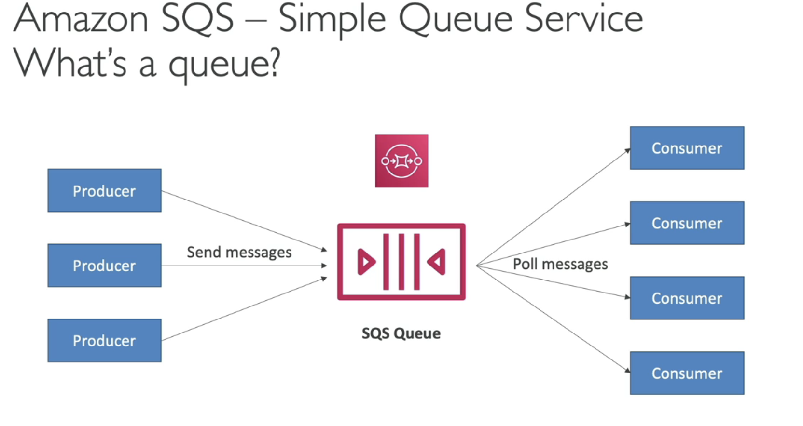

#########
Synchronous and Asynchronous Communications

Synchronous -> Buying then Shipping
Asynchronous -> Buying then Queue then Shipping

Synchronous is weak, because a) you can have spikes b) one day you may have to decode 12000 videos instead of 10.

#######
SQS - Simple Queue Service
Oldest offering of AWS (10 years old)
simple queue, decouple applications
fully managed
no limit of msgs in the queue
messages are deleted after read by consumers

#######
