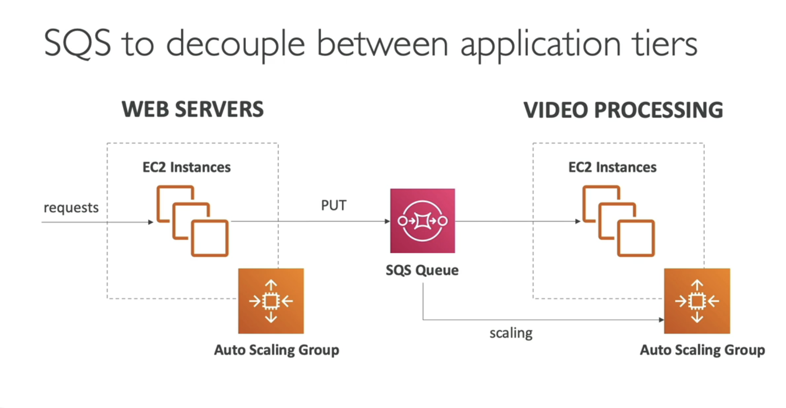

#########
Synchronous and Asynchronous Communications

Synchronous -> Buying then Shipping
Asynchronous -> Buying then Queue then Shipping

Synchronous is weak, because a) you can have spikes b) one day you may have to decode 12000 videos instead of 10.

#######
SQS - Simple Queue Service
Oldest offering of AWS (10 years old)
simple queue, decouple applications
fully managed
no limit of msgs in the queue
messages are deleted after read by consumers
can be FIFO

#######
Kinesis - Real-time Big Data Streaming

#######
SNS - Simple Notification Service

One message to SNS, to many Receivers

#######
Amazon MQ

In order not to adapt your app into SQS and SNS
Amazon MQ do it for you
Only if Migrating to the cloud, else SQS or SNS