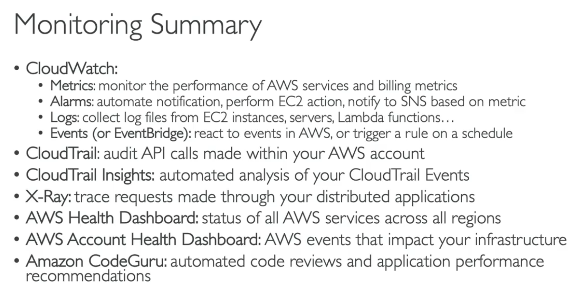

#######
CloudWatch Metrics

EC2 metrics (not RAM)

Metrics default 5m can pay for 1m

EBS metrics

S3 metrics

Billing metrics

Service limits

Custom metrics

#######
CloudWatch Alarms

If a metric reach a threshold triggers alarm, (eg. SNS notification)

OK
INSUFFICIENT_DATA
ALARM

####### 
CloudWatch Logs

Make agent on the other app,
set IAM permissions

centralises logs, does not sent/stream them!

#######
EventBridge

Schedule - Cron jobs
Event Pattern - React to something
Trigger Lambda functions

#######
CloudTrail

enabled by default
history of all API calls, all events, anything

Send them to CloudLog or S3

CloudTrail Insights -> Analysis

#######
X-Ray

in distributed services, debugging is hard.
Tracing and Visual Analysis of your application
Troubleshoot
Understand Dependencies

#######
Code Guru (ML service)

Automate Code Reviews (Reviewer) - Java,Python
Application performance recommendations (Profiler)

#######
Health Dashboard

All regions, All services health
proactivity, alerting etc.

#######
Summary

