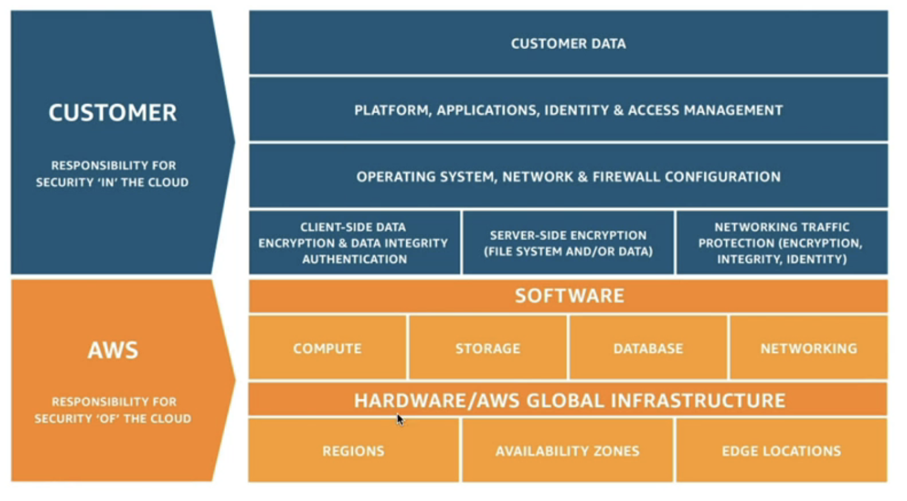
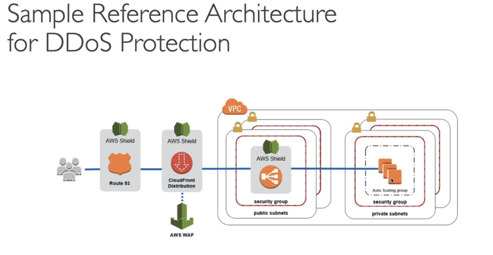
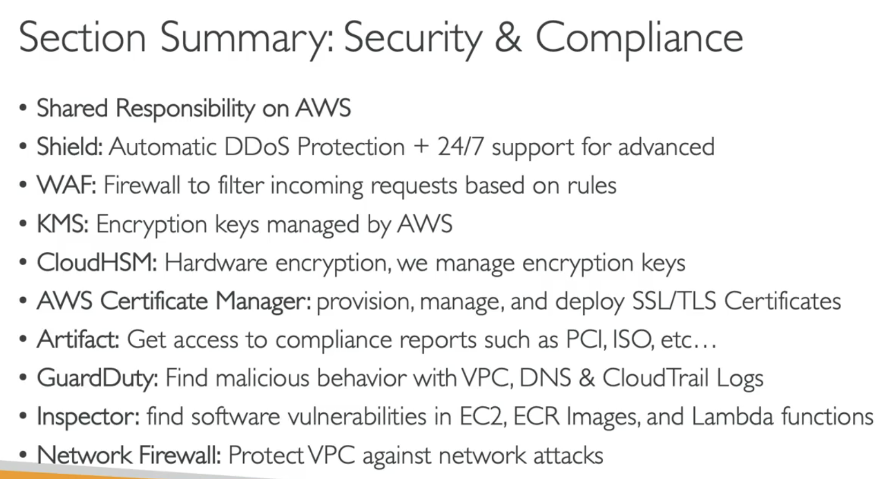
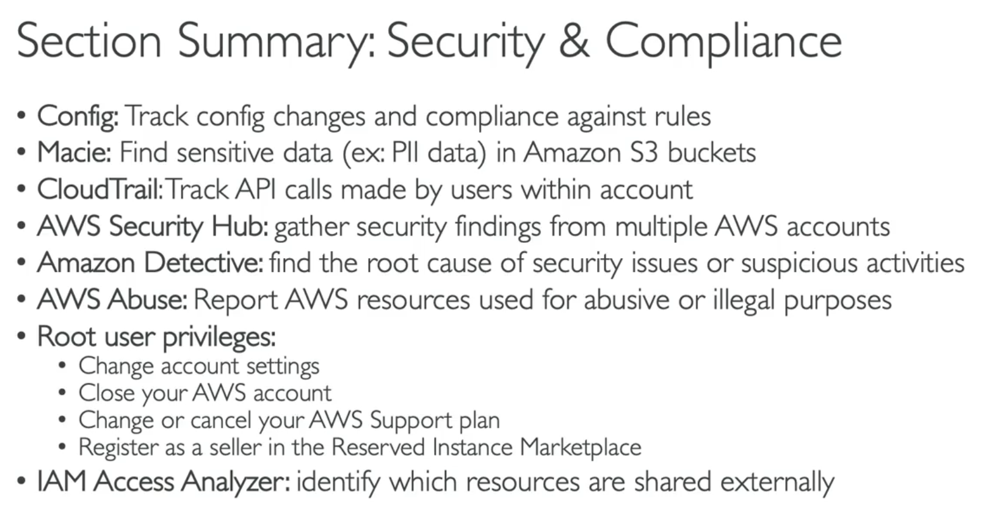

#######
RDS Responsibility

S3 Responsibility

Shared Responsibillity

#######
DDOS Protection: WAF and Shield

AWS Shield Standard - Free 
AWS Shield Advanced - 24/7 premium DdoS protection (3k per month)
WAF - Filter specific requests based on rules
Cloudfront and Route 53: Availability protection using global edge network, 
with Shield provides attack mitigaiton at the edge
Under attack you should SCALE - AWS Auto Scaling

#######
Network Firewall\
How to protect your entire VPC at once?
operates at VPC level

#######
Summary

