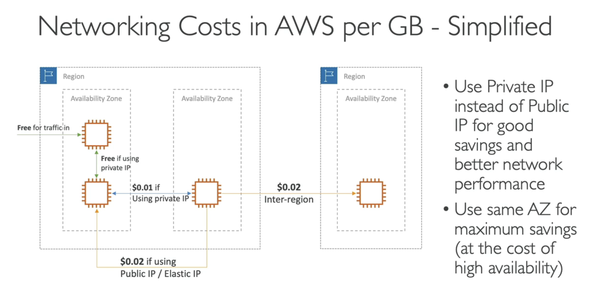

#######
Organizations

#######
Consolidated Billing can save us money, cause utilises hardware which is sitting.

#######
Control Tower
Setup and Govern a secure and compliant multi account env

#######
RAM

#######
Pricing Models

Pay as you go
Save when you reserve
Pay less by using more
Pay less as AWS grows

FREEEEEE

EC2 - charged for what you use
On-demand instances: per second or per hour
Reserved instances: 75% from on-demand for longer sessions
Spot instances: up to 90%, but you can lose them
Dedicated host: Reservation for 1 or 3 years
Savings plan: save on sustained usage

Lambda
pay per call
pay per duration

ECS
EC2 launch pricing, no additional fees for ECS

Fargate
pay only for cpu and memory of containers

S3
number and size of objects

EBS
Volume type
Size in GBs
SSD vs IOPS (fast) SSD vs Magnetic

Database 
per hour billing
Db characteristics
-on demand
-reserved (1 or 3 years - smart)
if backup or not

RDS
in is free, out is charged
number of I/O
additional storage

Networking Costs

#######
Savings Plan
think of money, not infra

#######
Calculator -> estimate/calculate costs

#######
Billing Dashboard -> Monitor
Free Tier Dashboard -> Track costs
Cost and Usage Reports -> Its all in there
Cost Explorer -> High Level (can forecast)

#######
Billing Alarms (CloudWatch)
Simple Alarm

#######
Budgets
create budget and send alarms when cost exceeds it
5 sns per budgets

#######
Cost Anomaly Detection

#######
Services Quotas
Limits
eg. Lambda concurrent executions reach threshold

#######
Trusted Advisor 
runs by itself
AWS account assessment

#######
Support Plans

#######
Summary Account Best Practices

Summary Billing and Cost
