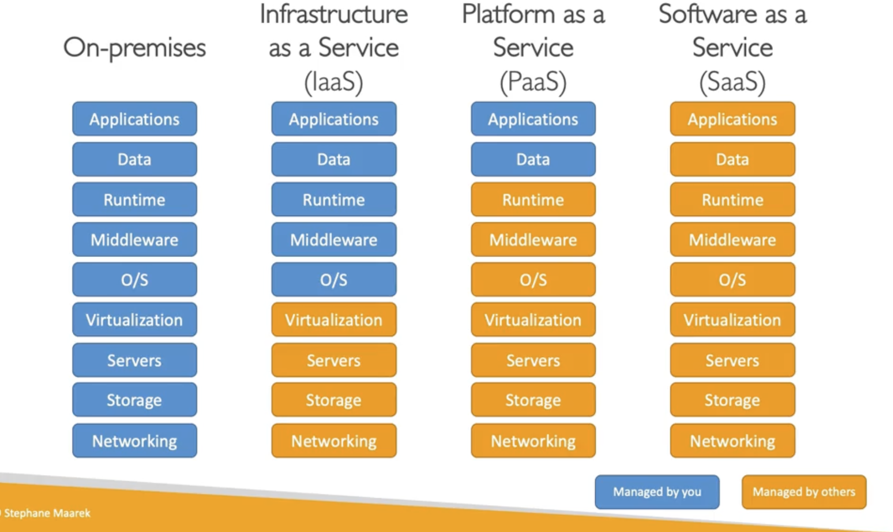

###########

ON DEMAND
pay-as-you-go
right size and type
instant access
simplicity
you access them via web app (AWS)

PRIVATE CLOUD (rackspace)
PUBLIC CLOUD (azure, gcp, aws)
HYBRID CLOUD (some on premises, some into the cloud)

5 characteristics:
ON DEMAND
Broad network access
Multi-tenancy and resource pooling
Rapid elasticity and scalability (SCALE)
Measured usage

6 advantages:
Trade (capital expense) CAPEX for OPEX (operational expense)
Benefit from massive economies of scale (low prices cause large scale)
Stop guessing Capacity
Increase speed and agility
Stop maintaining data centers

Problems solved:
Flexible
cost effective
scalability
elasticity
high availability
agility

###########

Infrastructure as a Service (IaaS)
Platform as a Service (PaaS)
Software as a Service (SaaS)

example:
IaaS -> Amazon EC2 (AWS), GCP, Azure, Rackspace, Linode
PaaS -> Elastic Beanstalk (AWS), Heroku, Google App Engine (GCP), Windows Azure (Microsoft)
SaaS  -> Many AWS services (ex. Rekognition for ML)

pricing fundametntals
COMPUTE (pay for compute time)
STORAGE (pay for data stored)
DATA (when data leaves cloud, when in its free)

###########

AWS launched 2002
Amazon Infra Market 2003
Launched publicly SQS 2004
Re-Lanuched with SQS, S3, EC2
Launched in EU 
then Dropbox, Netflix, airbnb, NASA etc..

AWS has regions with naming codes in the console
us-east-1 eg.
**Most services are scoped to a specific region, so when we are using them in another region they are like new services
You are launchig your apps 
a) close to your clients (proximity)
b) data governance (compliance)
c) available services (not all regions have all services installed)

###########

Responsibility / security in the cloud

![[Screenshot 2023-11-11 at 19.10.13.png]]

No illegal, Harmful, or Offensive Use or Content
No Security Violations
No Network Abuse
No E-Mail or Other Message Abuse
