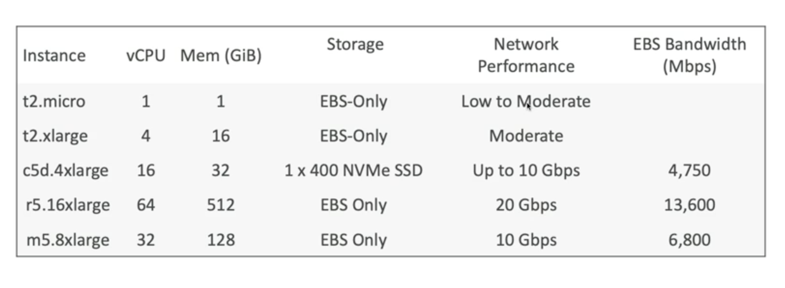
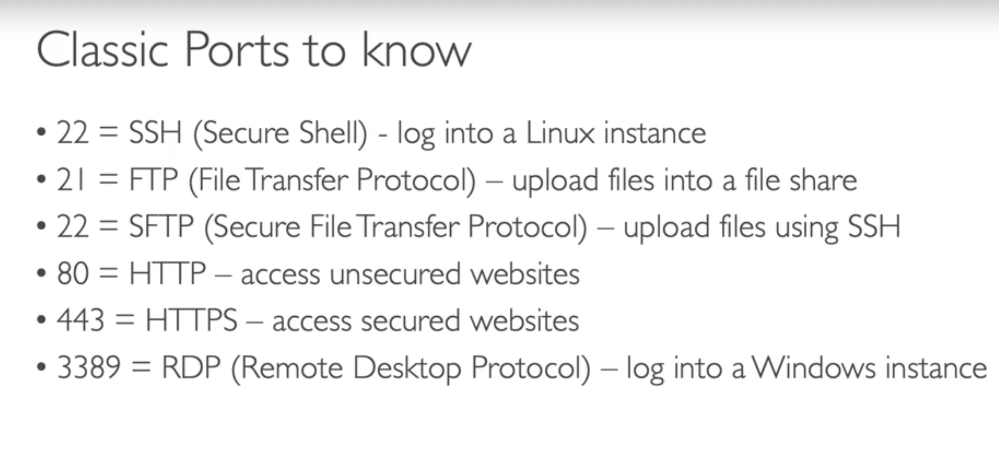
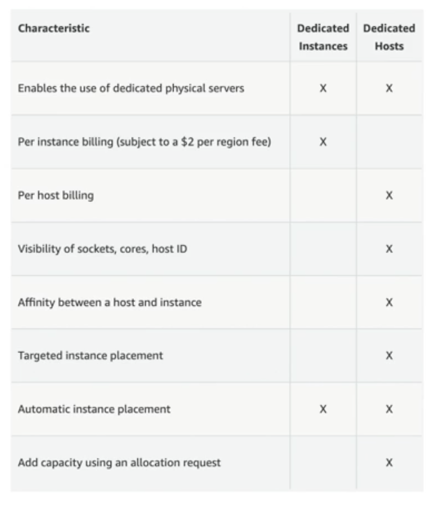
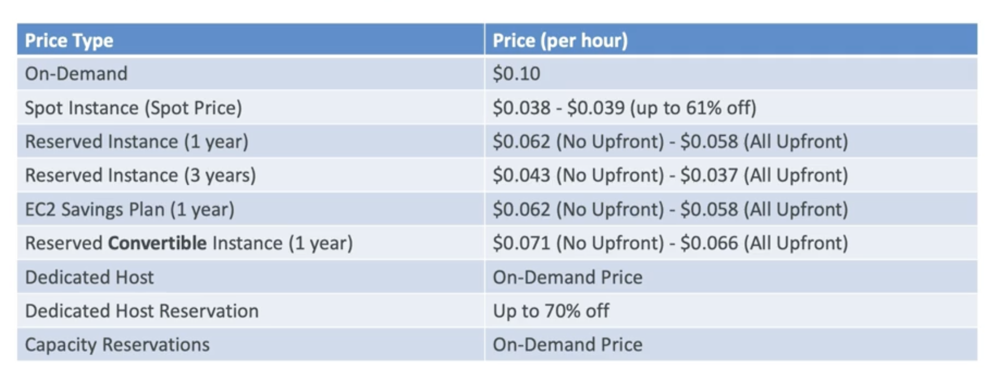
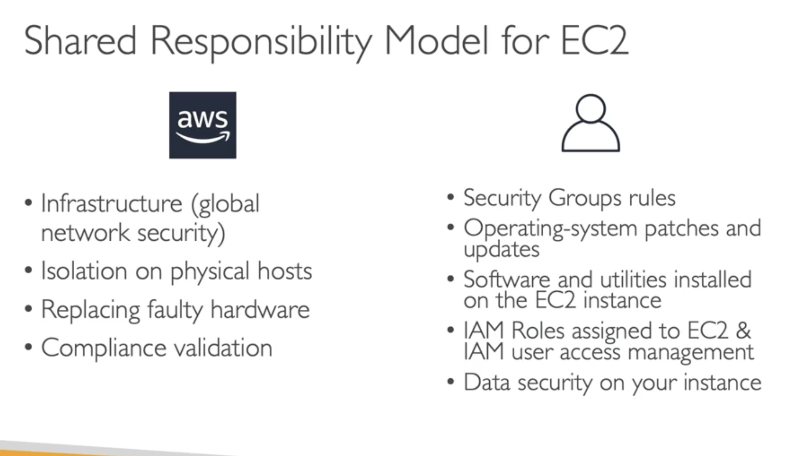

EC2 most popular AWS offering - Elastic Compute Service

bootstraping means launching commands when a machine starts
eg install updates, software, common files etc.

EC2 user script must run on root user
t2 is free-tier

C-instances: compute optimised
R-instances, X1, High Memory, z1: memory optimised
I-instances, d, h1: Storage optimised

ec2instances.info : can check all the info about instances

application not accessible (timeout) : security group issue

The logic is to use Security groups as Firewalls, limit IPs and Ports Inbound, and Outbound everything

reserved instances vs on demand (upfront money, or by usage)
reserved of course are cheaper
you can buy or sell reserved instances in marketplace
spot instances are dangerous so dont use for critical workloads (use them for EDA, image analysis, etc.)

Dedicated host : a physical server dedicated to your use (in case of compliance, regulations)

On demand: coming and staying whenever you like
reserved: like planning ahead, and with discount
savings plan: pay a certain amount per hour for certain period
spot instances: the hotel allows people to bid for the empty rooms and the higest bidder keeps the rooms you can get kicked out
dedicated hosts: we book an entire building of the resort
capacity reservation: you book a room for a period with full price even you dont stay in

Dedicated instance:
Your instance runs on some dedicated hardware. **Its not lockdown to you**. If you stop/start instance, you can get some other hardware somewhere else. Basically, the hardware is "yours" (you are not sharing it with others) for the time your instance is running. You stop/start it, you may get different physical machine later on (maybe older, maybe newer, maybe its specs will be a bit different), and so on. **So your instance is moved around on different physical servers - whichever is not occupied by others at the time.**

Dedicated Host:
With Dedicated Host the physical server is basically yours. It does not change, **it's always the same physical machine for as long as you are paying.**

Spot instances:
A Spot Instance is **an instance that uses spare EC2 capacity that is available for less than the On-Demand price**. Because Spot Instances enable you to request unused EC2 instances at steep discounts, you can lower your Amazon EC2 costs significantly. The hourly price for a Spot Instance is called a Spot price. (BUT THEY CAN KICK YOU OUT AT ANY POINT)

Summary:

EC2 is IaaS
EC2 has OS, CPU+RAM, Storage, security groups, Script User Data bootstrap
Security Groups: Firewall
EC2: script at the start(bootstrap)
SSH: terminal to EC2 (port 22)
EC2 instance ROLE: Link to IAM roles (permission to ec2)
Purchasing options (for exam): On-demand, Spot, Reserved, Dedicated host, Dedicated instance
