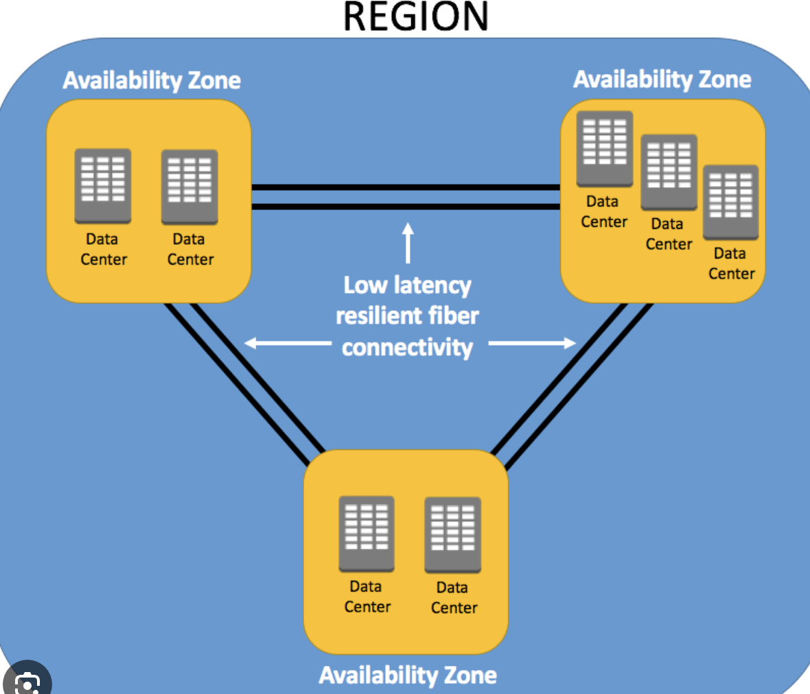
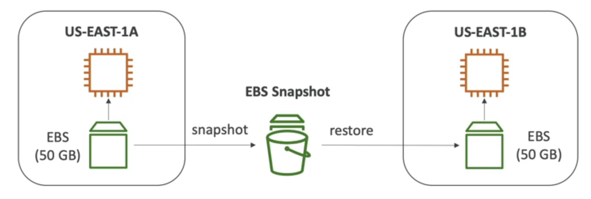
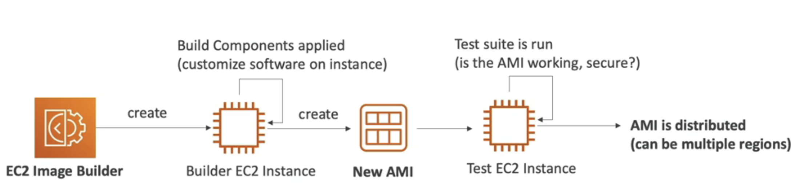
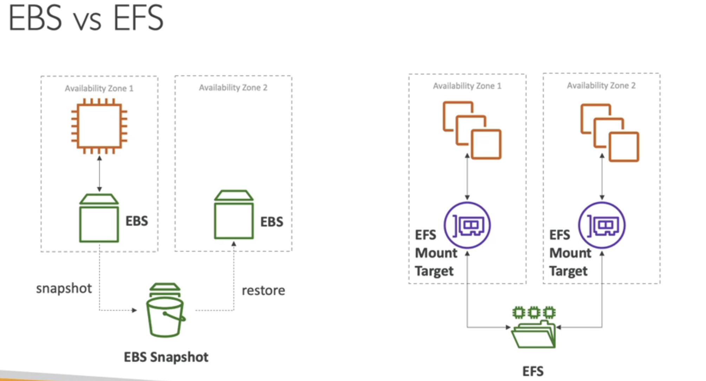
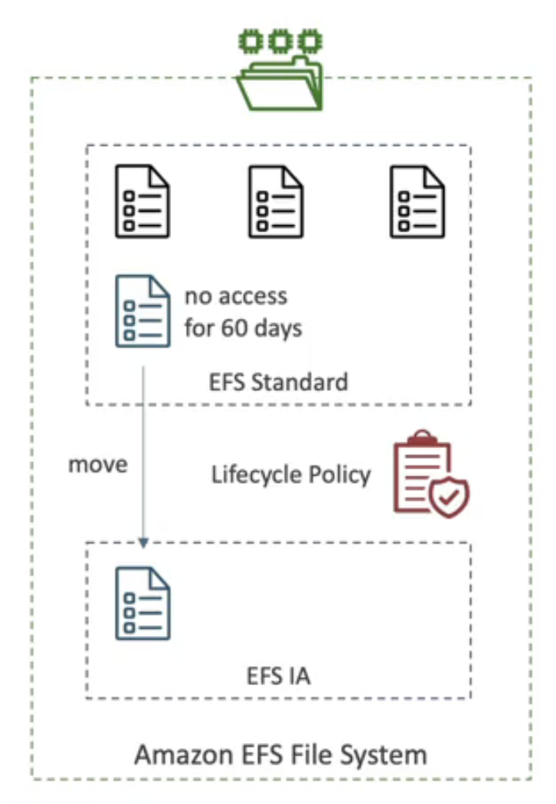
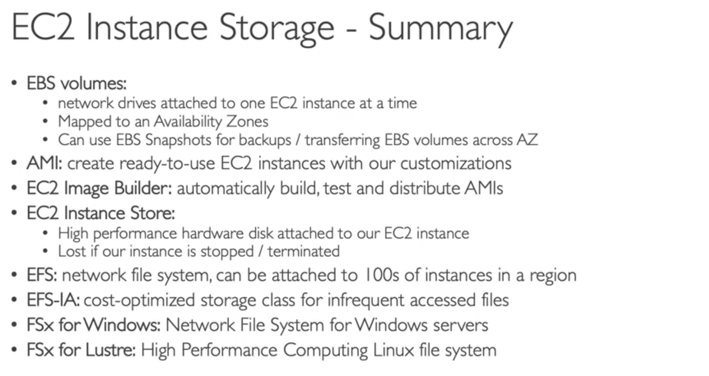

One EBS cant belong to 2 EC2, like a USB stick
(While I say that in the previous lecture that EBS volumes cannot be attached to multiple instances, I know it is not true for io1 and io2 volume types: this is called the EBS Multi-Attach feature.)

they are scoped in Availability zones: an EBS volume in us-east-1a cannot be attached to us-east-1b

Delete on Termination attribute: by default only in root EBS
if you want to preserve the root data, disable that.

EBS snapshot, can copy snapshots across AZ or Region

There is a snapshot archive (i75% cheaper than living)
Can copy snapshots to other regions (eg. disaster recover strategy)

Copy -> Create Volume from Snapshot

Recycle Bin: protect from accidental deletion
it works with Retention Rules

############
AMIs are Amazon Machine Images (etoima VMs pre-packaged)
can even buy from marketplace (an AMI)

AMI vs Snapshot EBS:
Most basic difference between AMIs and snapshots are the type of services they are associated with. **Snapshots are associated with EBS while AMIs are associared with EC2 instances**. Snapshots are the backup of the data on EBS volumes, whereas AMIs are bootable copy of the whole EC2 instances.

eg AMI can include (ram, cpu type, ebs etc.)
eg Snapshot can only contain Storage

You cannot use AMIs to add your IP addresses. IP addresses are added to an instance as you create it.

############

EC2 Image Builder : automate the creation of Virtual Machines or container images

can be scheduled etc.. 
it is a free service. ( you are paying only for the EC2 instances, or Storage etc..)

#############

EC2 Instance Store
If you need a high performance hardware disk, use the EC2 instance store
if stopped, lose their storage (so use it for buffer, cache, tmp content, scratch data)

(Scratch space is **space on the hard disk drive that is dedicated for storage of temporary user data**.)

they start from ixx lettering (eg. i3n)

###############

EFS - Elastic File System
Shared network filesystem (you can share it with multiple EC2s)
EFS works with linux ec2
expensive

EBS vs EFS

EFS-IA
cost-optimised for files they are not accessed every day
Up to 92% lower price in comparison with EFS standard
EFS will automatically move your files to EFS-IA

############
Amazon FSX

instead of EFS, or EFSIA

FSX for Windows
Windows file-system
Support SMB, NTFS
Microsoft active dir

FSX Lustre
High performance file storage for High Computing
Machine Learning, Analytics, Financial Modeling
sub-ms latencies

#############
SUMMARY

