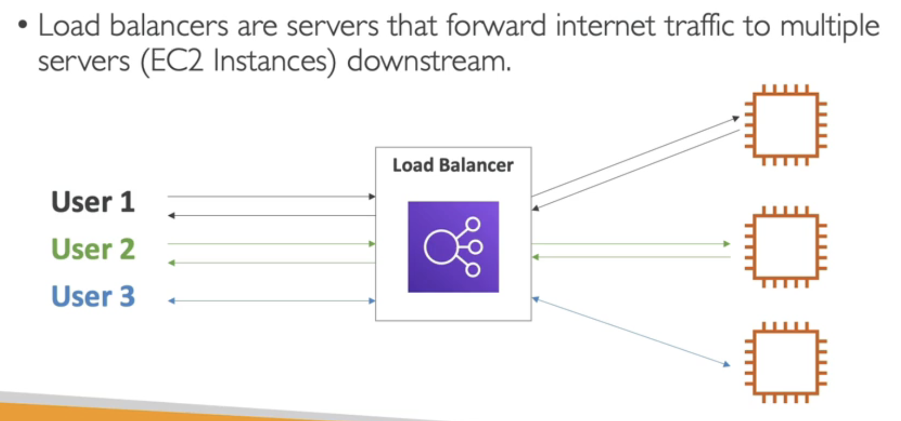
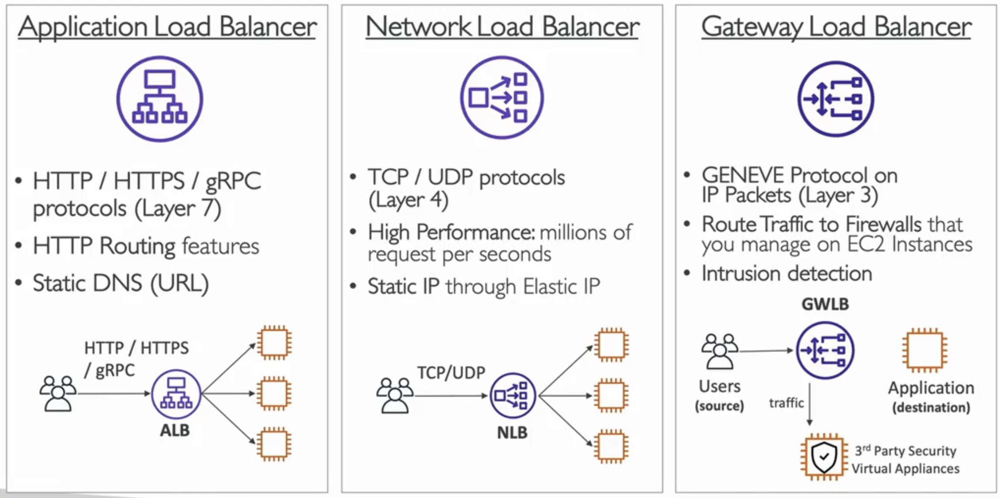
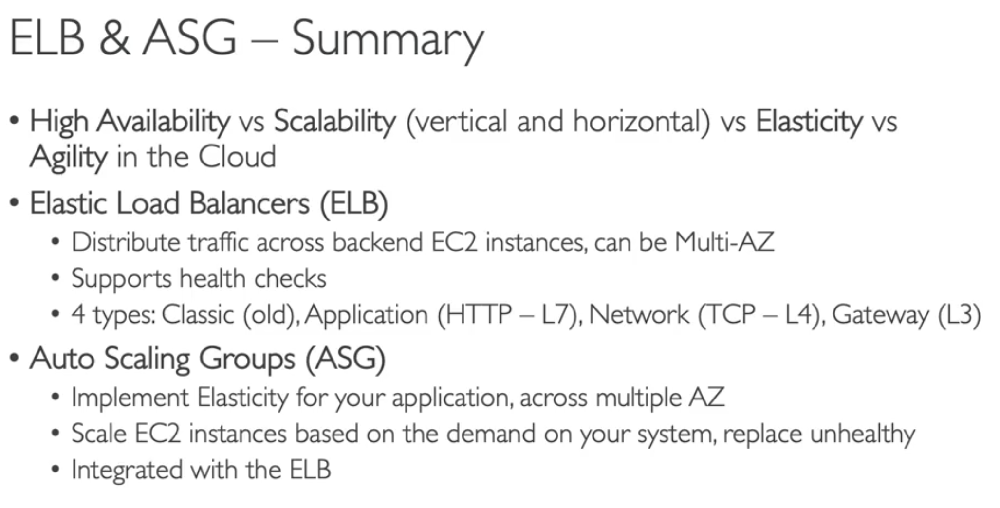

Scalability
Scalability means that an app can handle greater loads by adapting
Two kinds of scalability:
-Vertical Scalability: increase the size of the instance (eg. t2micro -> t2large)
-Horizontal Scalability (elasticity): more instances ()

High Availability
High Availability means you are running your app in at least 2 Availability Zones
Scalability is LINKED by DIFFERENT than High Availability
Can save your ass from disasters

Scalability: horizontal or vertical 
Elasticity: means that there will be auto-scaling based on the load somehow 
Agility: new IT resources are only a click away (you are faster)

##############
A load balancer serves as the single point of contact for clients. The load balancer **distributes incoming application traffic across multiple targets, such as EC2 instances, in multiple Availability Zones**. This increases the availability of your application. You add one or more listeners to your load balancer.

Elastic Load Balancing

ELB is a managed load balancer (you dont have to setup)
You can setup your load balancer cheaper but, its a lot of effort

############

Auto Scaling Group
load of websites can change
ASG helps to : scale out, scale in based on demand
can replace unhealthy instances
HUGE COST SAVINGS (elasticity)

WEB TRAFFIC -> LOAD BALANCER -> AUTO SCALING GROUP

Dynamic scaling
When a cloud-watch alarm is triggered (eg cpu>70% add)

Target Tracking
I want the average CPU to be at 40%

Scheduled Scaling
increase the min capacity to 10 at Friday 5pm (eg. football)

PREDICTIVE SCALING (SOS)
Uses machine learning to predict future traffic ahead of time
Useful when your load has predictable time-patterns (periodic time-series)

#############
SUMMARY

