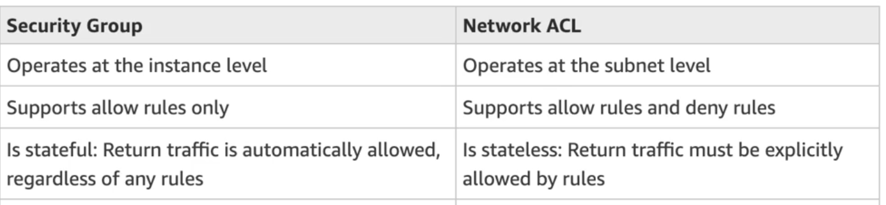
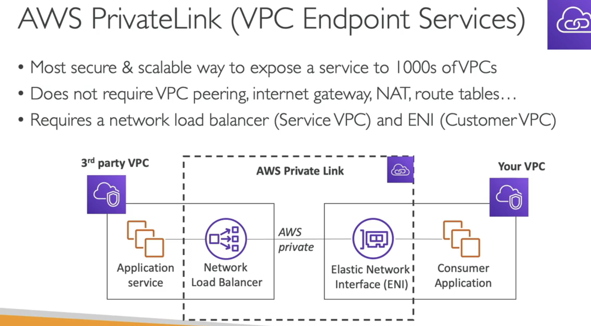
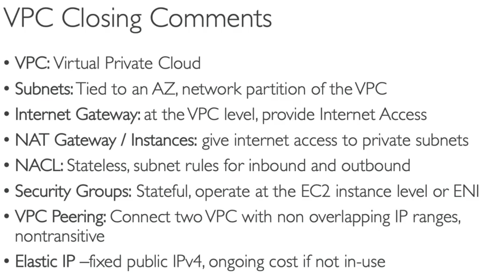
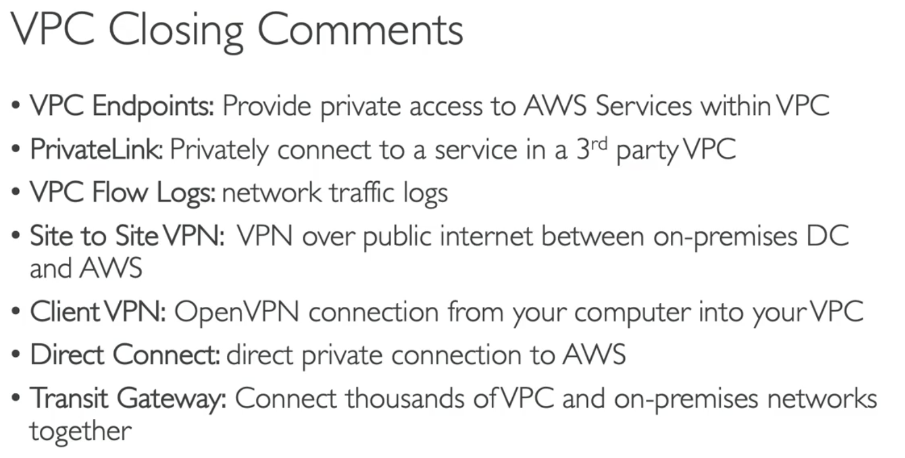

#######
IP Addresses
IPv4  (4.3 Billion Addresses)
private IPs are static for EC2
Elastic IP -> add a fixed public Ip to an EC2 instance
IPv6 (3.4 x 10^38 Addresses)

#######
VPC
Like VPNs but for inside the AWS

#######
Security

#######
VPC Endpoints
use a private network for services instead of public internet (low latency, security)

#######
Private Link
Most secure and scalable way to expose a service to 1000s of VPCs 

#######
Site to Site VPN
Connect on premises with AWS over public internet
fast

#######
Direct Connect
Establish a physical connection with AWS (cable)
slow

#######
ClientVPN
connect from ur computer using openVPN to your private network in AWS

#######
Transit Gateway
A way to connect hundreds of thousand of VPCs with your on premise infra -> Transit Gateway

#######
Summary

