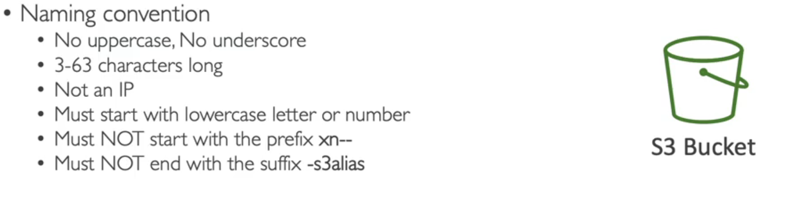
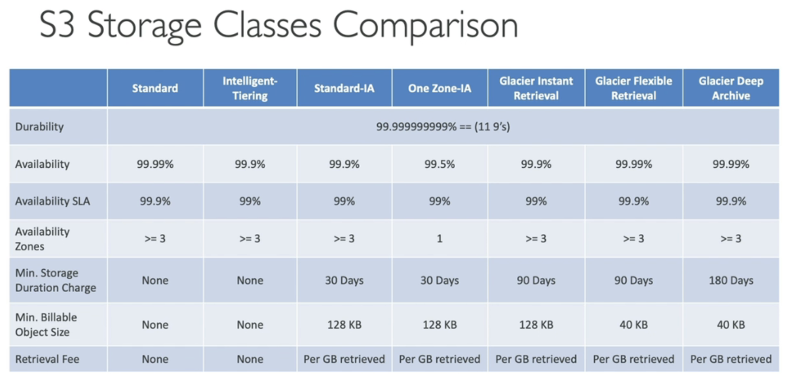
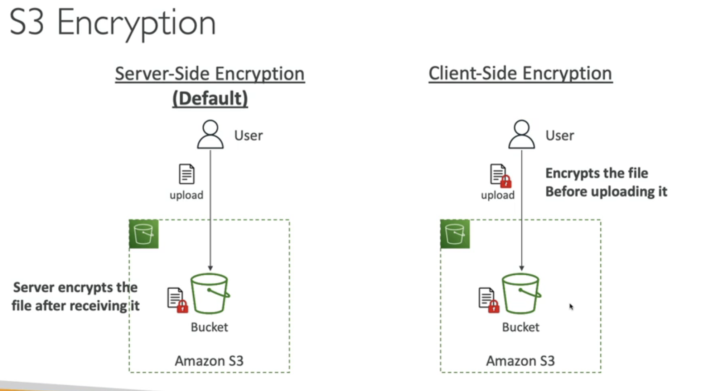
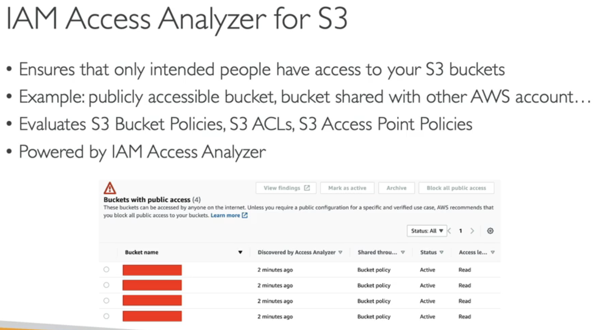
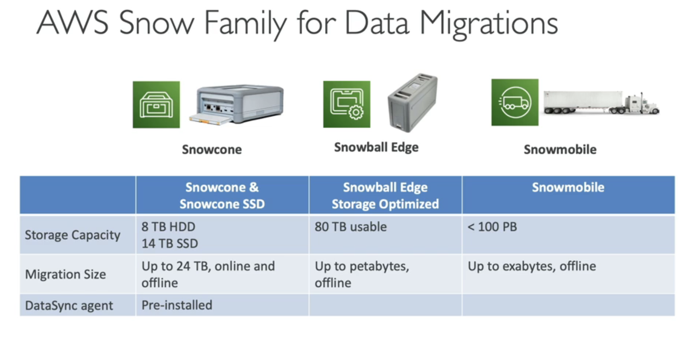
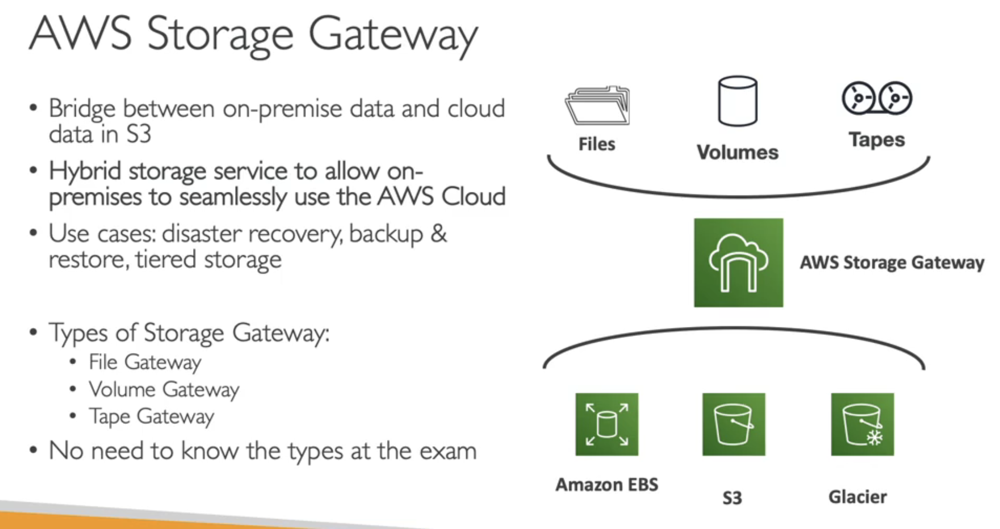

Buckets: 
are top level directories
the files stored in buckets called objects
Buckets must have globally unique name (everywhere, all acounts)
Buckets are defined at the region level
Naming: 

Keys
Objects have a Key:
The key is the full path: s3://my-bucket/my_file.txt

THERE ARE NO DIRECTORIES IN AMAZON S3!!!
EVERYTHING IS A KEY!!!

Object:
Max object size < 5TB (5000GB)
then you need to split it in parts

Metadata: system or user metadata

Tags: unicode key, value pair up to 10 - useful for security lifecycle

VersionID: if you have enabled versioning

#############
Security (Bucket Policy)
Userbased - IAM policies (for aws internal users)
Userbased - IAM Roles (for aws internal instances eg EC2)
Resource Based - bucketwide roules (Bucket policies) (for web)
s3 bucket policies are json
extra bucket settings for Block Public Access

##############
Website
s3 can host static websites and have them accessible on the internet
403 forbidden error (means bucket is not public, need to attach bucket policy to make it public)

##############
Versioning 
Enable it on bucket level
do it because it protects from unattended deletes
you can roll back easily
suspending versioning, does not delete previous versions

################
Replication
CRR - Cross Region Replication
SRR - Same Region Replication

################
Durability: (99.999999999 loss of object in amazon s3 impossible)
Availability :(99.99 how readily available a service is (53 mins a year down))

################
Storage Classes

-S3 Standard - General 
(frequently accessed data)
(low latency, high throughput)
(data analytics, gaming, content distribution)

-S3 Standard-IA
(for data less frequently used, but requires rapid access when needed)
(disaster recovery, backups)

-S3 One Zone-IA
(for secondary backups)

-S3 Glacier Instant Retrieval (low cost)
(minimum 90 days)
(great for data accessed once in quarter)
90 days min

-S3 Glacier Flexible Retrieval (low cost)
(you wait for )
Expedited: 1-5 minutes
Standard: 3-6 hours
Bulk: 5-12 hours
90 days min

-S3 Glacier Deep Archive
Standard: 12 hours
Bulk: 48 hours
min storage duration 180 days

-S3 Intelligent Tiering
Move objects automatically between access tiers based on usage

#############
Encryption

###############
IAM Access Analyser for S3

#################
AWS Snow Family

Helps with Data Migration, cause data transfer over the network takes a lot of time

SnowFam
If it takes more than a week to transfer data over network -> Use SnowDevice provided by Amazon (load the data there, and sent it back)
one location (load the data at once)

SnowEdge
many multiple locations (incrementally store items)

SnowCone
little amount of data
where snowball does not fit, u must use ur cables and battery

SnowMobile
an actual truck to transfer Data
Exabyte of Data
High security, temperature controlled, GPS etc.

You can use these devices with OpsHub

################
Hybrid Cloud for storage
half on premises, half on cloud

To expose S3 on premises you have to use AWS Storage Gateway
Bridge Storage from on-premises to the cloud

