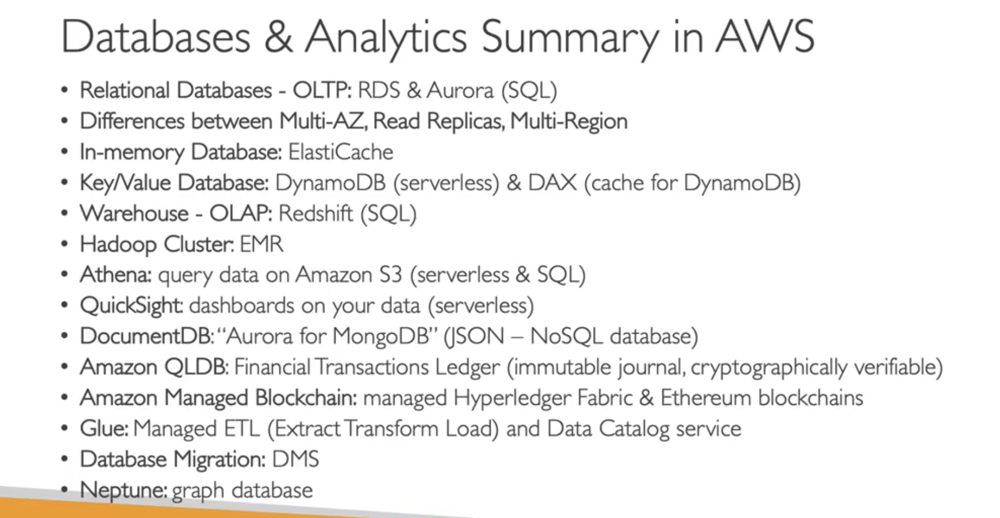

Databases
If you want to store data in a structured way  you need databases.
Databases provide indexes, query, search etc.

Relational Databases
Like Excel sheets but with links with each other
vertical scaling
(relations)

NoSQL Databases (non relational dbs)
flexible schema
easier to evolve data model
scalable (horizontal)
eg. key-value, document, graph, in-memory, searchdbs
can have data in JSON format

Managed Databases
High Availability, Vertical - Horizontal Scaling
OS patching is handled by AWS
Monitoring, Alert

You can run your own DB, but you must handle yourself resiliency, backup, patching, fault tolerance etc.

######################
AWS RDS - Relational DB
Postgres, MySQL, MariaDB, Oracle, MS SQL, Aurora
RDS is Managed from AWS
You cant SSH
RDS is free-tier

#####################
Aurora - Relational DB
Managed from AWS
Postgress SQL and MySQL
Aurora is cloud optimized (3x and 5x from RDS)
20% more expensive than RDS

Aurora Serverless
No capacity planning
Least management overhead/ unmanaged
good for infrequent, unpredictable wokloads

######################
Read Replicas RDS
You can create DB replicas for faster Read times
Faster Read Times - Scalability

#####################
RDS Multi-AZ deployments 
For High Availability

#####################
ElastiCache (in-memory databases)
high performance - low latency
Cache, reduce load of DBs for intense Read
for same loads needed often

#####################
DynamoDB - NOSQL - Flagsip Product
Managed AWS 
dstributed serverless database - massive workloads
Serverless databases (no need to provision instances)
Single-digit ms latency - low latency
IAM security
LowCost 
Autoscaling
Standard & Infrequent Access flavours

DynamoDB Accelerator - DAX
is like a Cache (instead of ElastiCache)
fully integrated for DynamoDB

Global Tables for DynamoDB
Multi-Region Read and Write to the table
Active Active Replication

#####################
Redshift Database
based on PostgreSQL
analytics - warehousing
OLAP (online analytical processing)
Load data every hour - not continuously
Column Storage (NO ROW like the others)
Massive Parallel Query execution
integrated with BI, (tableau etc.) can do some computations* or visualizations*

Redshift SERVERLESS (scaling, provisioning)
The same as above but without managing the underlying capacity or infrastructure!!!

#####################
Amazon EMR
Elastic MapReduce - HADOOP
EMR helps creating Hadoop, Hadoop is open source and they allow multiple servers (cluster) to analyze the data together
EMR can use 100s of EC2s collaborating
Also supports Apache Spark, HBase, Preso etc.
EMR takes care of provisioning and configuration
Auto-scaling 
cases: Data Processing, Machine Learning, web indexing, big data

#####################
Amazon Athena
Serverless performs analytics against S3 Objects
+Reporting with Amazon QuickSight
has SQL capabillities
Cases: Business intelligence / analytics/ logs/ 
EXAM: Analyze data in S3 serverless SQL

####################
Amazon QuickSight
Serverless machine learning business intelligence service to create interactive dashboards
RDS, Aurora, Athena, Redshift, Amazon S3
Go to tool for BI

####################
Document DB is the AWS version for MongoDB (which is NoSQL)
store, query, index Json
Scales to workloads with millions

Exam: MONGODB - DOCUMENTDB
(Nosql - documentdb - dynamodb)

###################
Amazon Neptune
Graph Database
For highly connected datasets (like social networks)
Can store billions of relations
Great for knowledge graphs, fraud detection, recommendation engines, social networks

###################
Amazon QLDB (Quantum Ledger Database)
record financial transactions
Immutable system, no entry can be removed
No Decentralization (its central database)
QLDB vs Amazon Managed Blockchain (is decentralized)

###################
Amazon Managed Blockchain
Compatible with Ethereum, Fabric Hyperledger

###################
AWS Glue
Extract, Transform and Load service (ETL)
You use it to prepare and transform the DATA
Fully serverless
You can take data from S3 and RDS to extract to other database

###################
Database Migration System DMS
Convert from Source to Target 

MIGRATION

####################
Summary (IMPORTANT)

 

