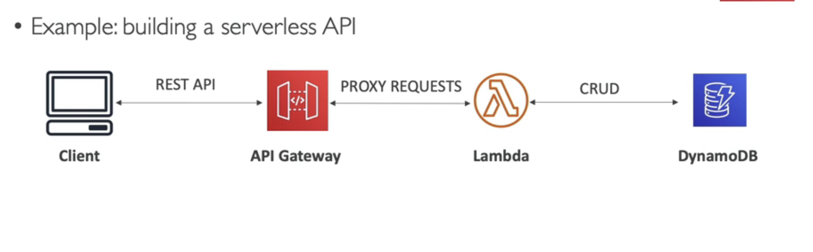
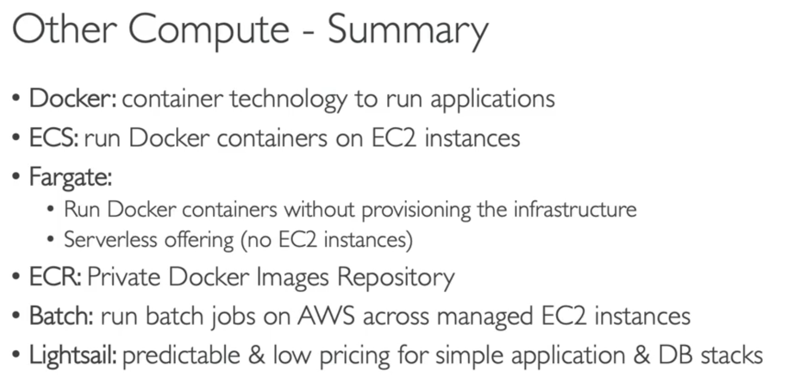
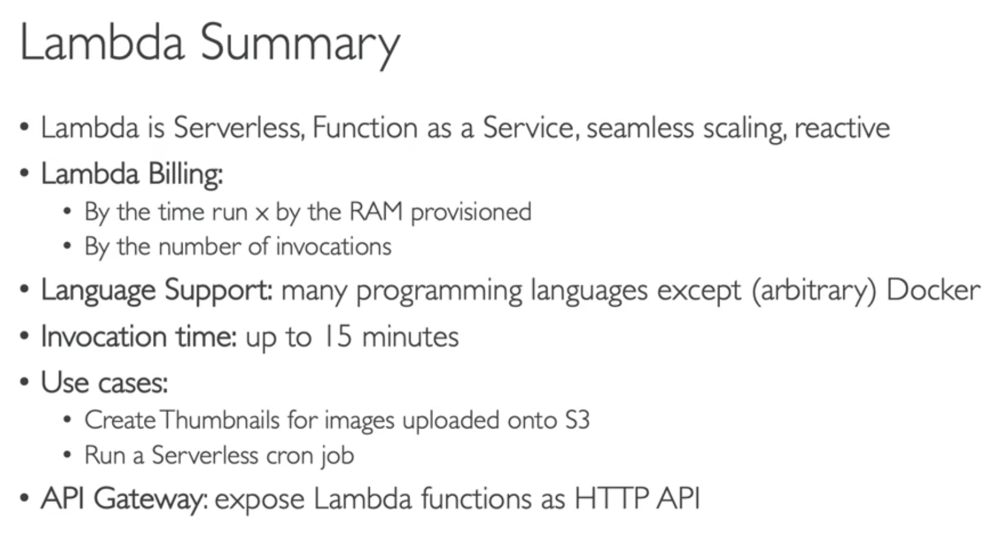

########################
Elastic Container Service (ECS)
You must provision and maintain the infra (you must provice EC2 urself)
AWS start/stop containers

Docker - ECS

########################
Fargate
Does the same as ECS, but Serverless
We dont manage any EC2

DOCKER SERVERLESS - FARGATE

########################
ECR - Elastic Container Registry
Like Dockerhub but AWS private

#########################
AWS Lambda
Integrated with the whole AWS suite
Event-Driven: Trigger when needed
1.000.000 Lambda requests and 400.000 GBs of compute time (FREE)
Javascript, Python,C#, Java, Go, Ruby etc.. or any through custom Runtime API
Lambda Container Image (if its lambda runtime API)

CASES: 
Serverless CRON job (run a script on schedule)
Event driven stuff

PRICING:
pricing based on calls, and duration
very cheap, very popular, serverless

##########################
API Gateway

Serverless
Exposes Services to the Internet through APIs

############################
AWS Batch

A batch job is a job with a start and an end
Batch will launch EC2 or Spot Instances
Scalable
Batch jobs are docker images and run on ECS

Lambda:
Time limit
Limited runtime
Limited temporary disk space
is serverless

Batch
No time
any runtime
rely on EBS store for disk space (no serverless)
relies on EC2

###############################
Amazon Lightsail (complete solution instead of services)
Low and predictable pricing
Simpler than services
Great for beginners
Notifications and monitoring
For a very simple web app
NO AUTOSCALING
NO INTEGRATIONS

################################
Summary:

Lambda Summary:
