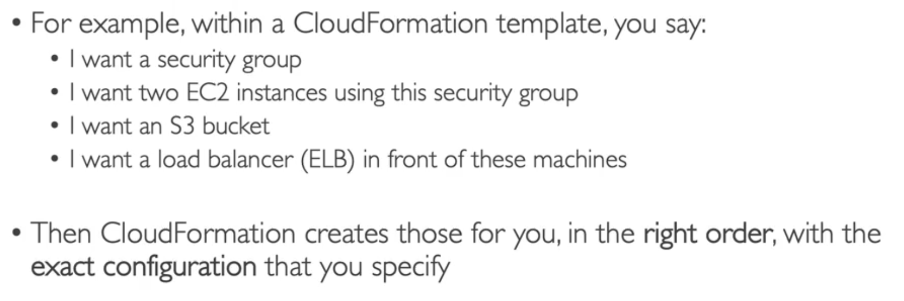
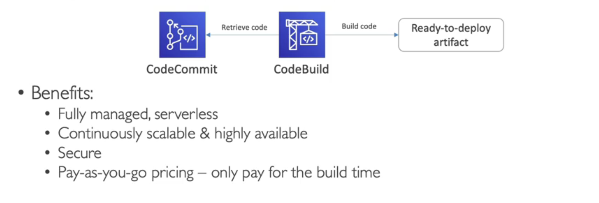
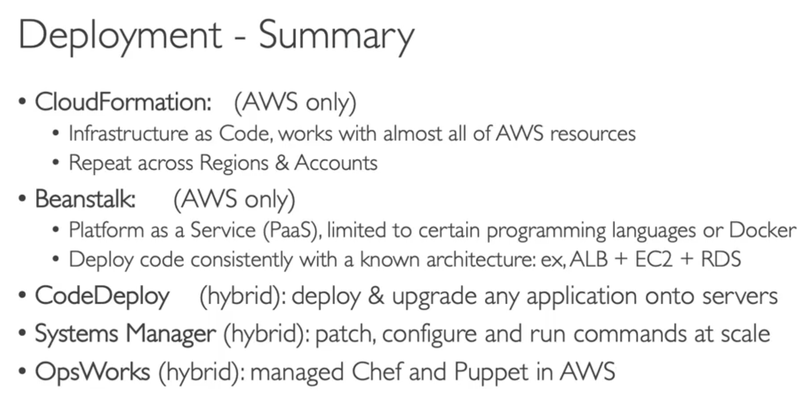
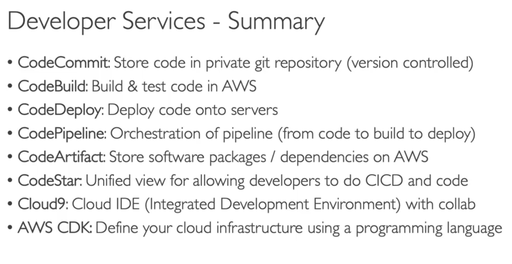

#######################
CloudFormation
Yaml file

Cost:
Each resources have an identifier so you can see how much a stack cost you
Saving Strategy (eg. start at 5 ,then recreate at 9)

Productivity:
Automated Diagram for you
No need to figure out ordering (which service first)
You can use existing templates from the web etc.

Cloudformation is the base of Infrastructure as code.
Repeat architecture in different envs, region or acounts.

########################
Cloud Development Kit

Instead of Cloudformation (its yaml), use a more familliar language(python,js etc.)
The code will be compiled in YAML finally in Cloudformation format

So we use it before Cloudformation always

#########################
BeanStalk (Platform as a Service)

Beanstalk is free but you will pay the underlying services

Health Monitoring built in

#########################
CodeDeploy
only handles EC2, does not take into account LoadBalancing, ASG etc.
HYBRID service

############################
CodeCommit

Its like github (version control repository)
Integrated with AWs
Fully managed
Scalable etc.

#############################
CodeBuild

Compiles source code, run test, produce packages
eg. workflow

############################
CodePipeline
Code -> build -> test -> provision -> deploy
Orchestrating steps CICD

############################
CodeArtifact

Storing and Retrieving Dependencies
works with dependency managements tools: pip, npm, yarn etc.

Artifacts management tools, also known as artifact repositories, are **used to store, organize and distribute artifacts (that is, binary files plus their metadata) in a single centralized location**. This reduces the amount of time spent downloading dependencies from a public place.

############################
CodeStar
One UI to use all the above services (codecommit, deploy, pipeline, etc.)

############################
Cloud9

Its a cloud IDE (visual code), no need to setup nothing.
allows for code collaboration!!

#############################
Systems Manager (SSM)

Help you manage your EC2 and On-Premises at scale
Hybrid service

EXAM Any time you see: 
A way to patch your fleet of EC2 instances or on premises
or run a command to all of your servers

#############################
System Manager Session Manager

Allows you to start a secure shell on your EC2 and on premises

better security, cause no SSH

SSM Session Manager Parameter Store
saving parameters 

#############################
OpsWorks
server configuration automatically

Chef or Pupper -> OpsWorks

##############################
Summary - Deployment

Summary - Developer Services
