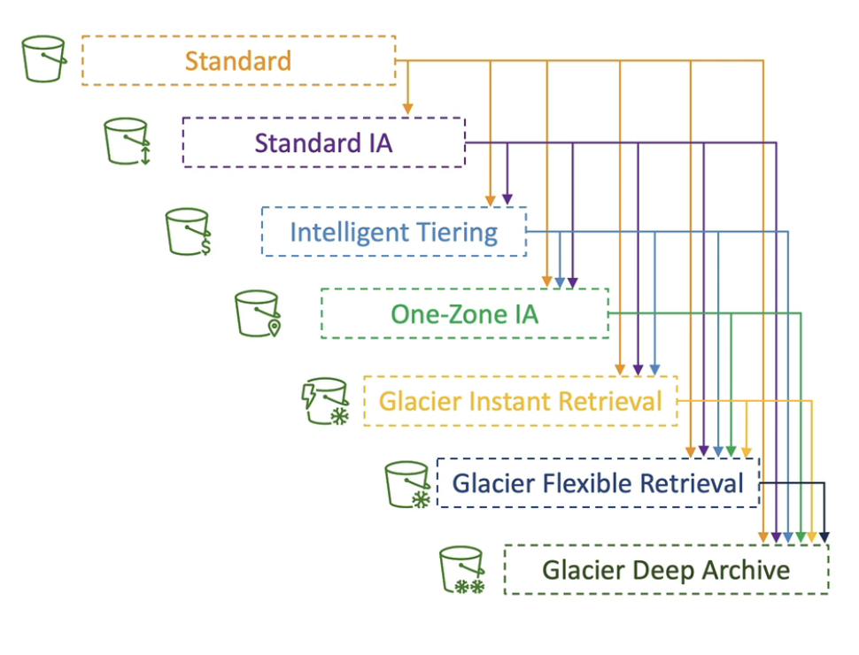
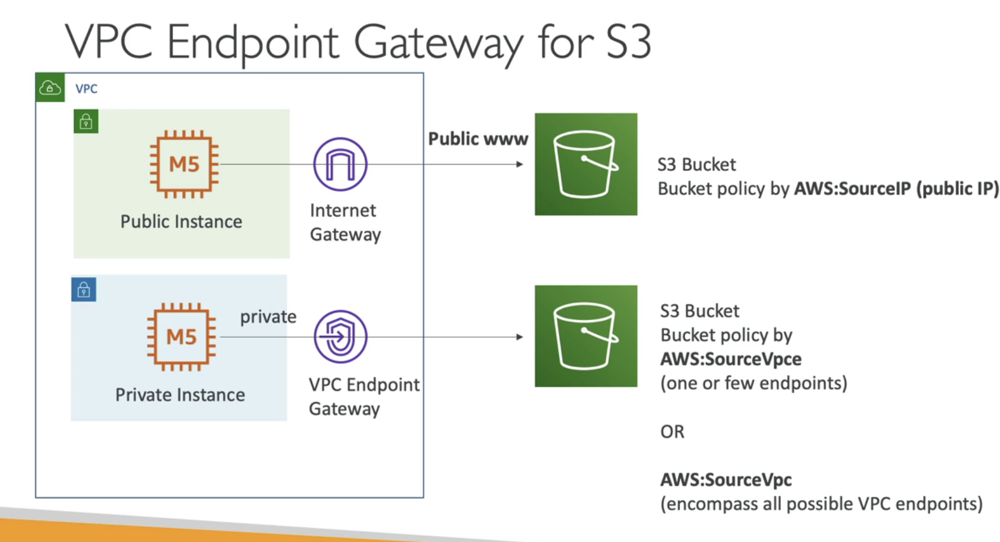
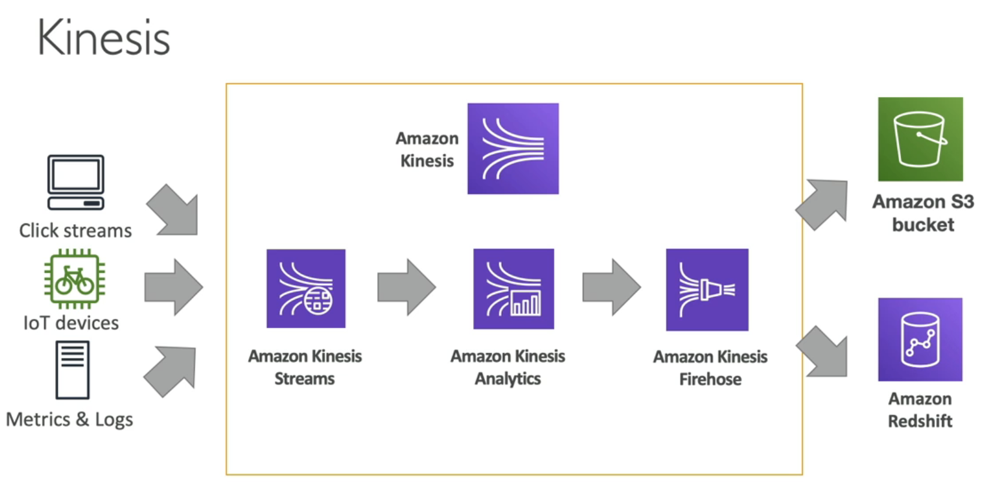

####### S3
buckets have a global name unique
buckets have key -> their key is the path ("bucket/my_file.txt") <- not folders BUT key names
UP to 5TB object size (you can split in different objects the big datasets)
object tags (key, values)

Data Lake (infinite size, 99.999999 durability, decoupled storage)
centralised architecture
object storage (any format)

Data Partitioning (speed up querying)
-by date ('s3://bucket/data/year/month/day/hour/data_00.csv')
-by product ('s3://bucket/data/product-id/data_32.csv')
any partitioning you like..

####### S3 Storage Classes
We can edit storage classes on the fly
You can program storage classes transitions

Durability: How many times will you lose an object 99.99999999 for S3
Availability: How readily a service is 99.99 for S3, Less AZ goes down

- S3 Standard - General Purpose
		frequently accessed data
		low latency high throughput

- S3 - Infrequent Access
		disaster recovery 
		can be also One zone, with less availability

- S3 - Glacier Storage (low cost)
		pricing for storage + object retrieval
		can be Instant Retrieval (millisecond retrieval)
		can be Flexible Retrieval (retrieval 1 minutes to 12 hours)
		can be Deep Archive (retrieve 12 hours to 48 hours (Bulk))

- S3 - Intelligent-Tiering (when we dont know our data patterns)
		Move objects automatically between acess tiers based on usage (frequent, infrequent, archive)
		No retrieval charges

Transition Actions
Expiration Actions
Rules can be created for a certain prefix or object tags etc..

Thumbnails only be kept for 60 days, that can be easily recreated. 
src imgs we need to instantly retrieve for 60 days and then can wait up to 6 hours to retrieve after the 60 days you can do:

source imgs: transition from Standard -> Glacier
thumbnails: One-Zone IA, expiration after 60 days

You can also use S3 Versioning in order to have object versions that can be recovered by a "delete marker"

You can use Amazon S3 Analytics, to decide object transitions (with a csv report)

####### S3 Security

- User Based (IAM policy (iam policy, or iam roles for instances)
- Resource Based (Bucket Policy, Object/Bucket Access Control List)
- Encryption Keys

####### S3 Encryption

- Server Side Encryption (SSE)
- Client Side Encryption (CSE)

SSE S3->  (default encryption )
encryption uses keys from AWS
object is encrypted server-side
AES-256 Encryption
this is the default

SSE KMS -> 
you manage the key using the AWS KMS service
you can audit the usage using CloudTrail
API calls to the KMS Service
maybe throttling if you have high throughput and everything moves through KMS keys

SSE-C ->
Server Side encryption using keys fully managed by the customer outside of AWS
Amazon S3 does NOT store the encryption key you provide (after use they are being dicarderd)

####### VPC Endpoints

####### AWS KINESIS

- Managed alternative to Apache Kafka
- Great for application logs, metrics, IoT, clickstreams
- Great for real-time big data
- Great for stream processing (spark, nifi etc)
- auto replication to 3 AZ

Kinesis Streams: low latency streaming ingest at scale
Kinesis Analytics: perform real-time analytics on streams using SQL
Kinesis Data Firehose: load streams into S3, Redshift, Elastic Search
Kinesis Video Streams:meant for streaming video in real-time

Example:
